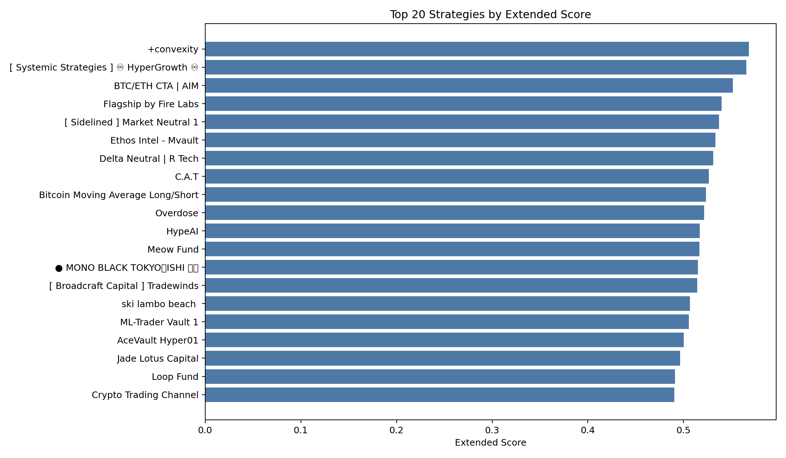
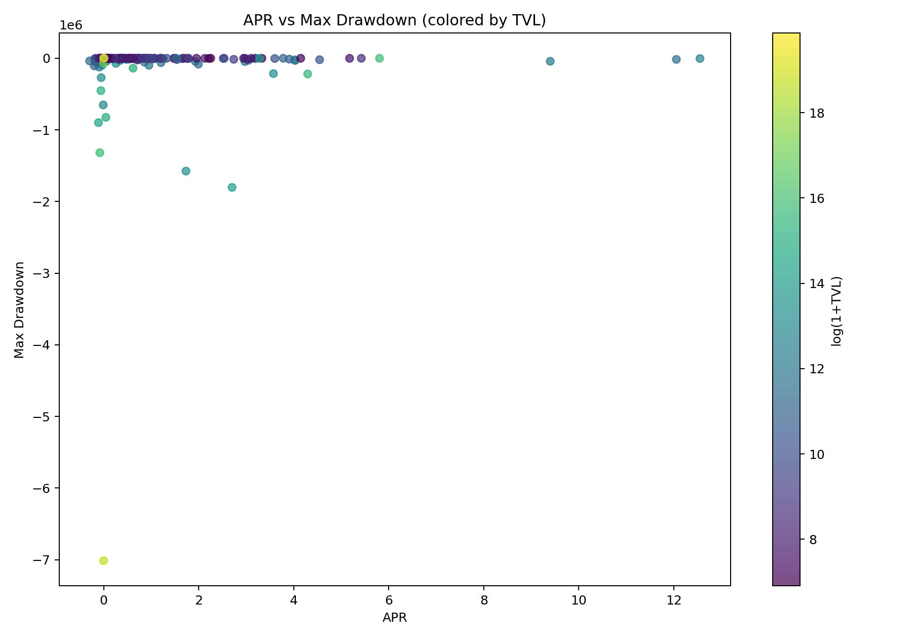
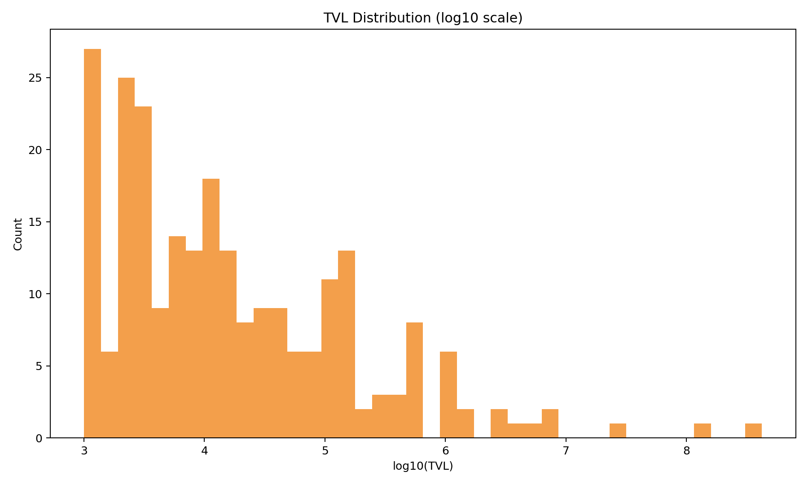
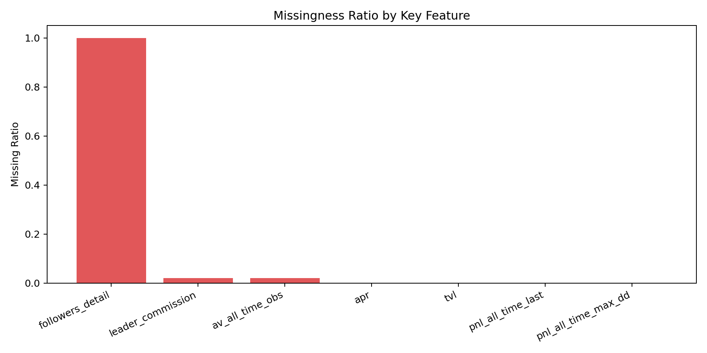
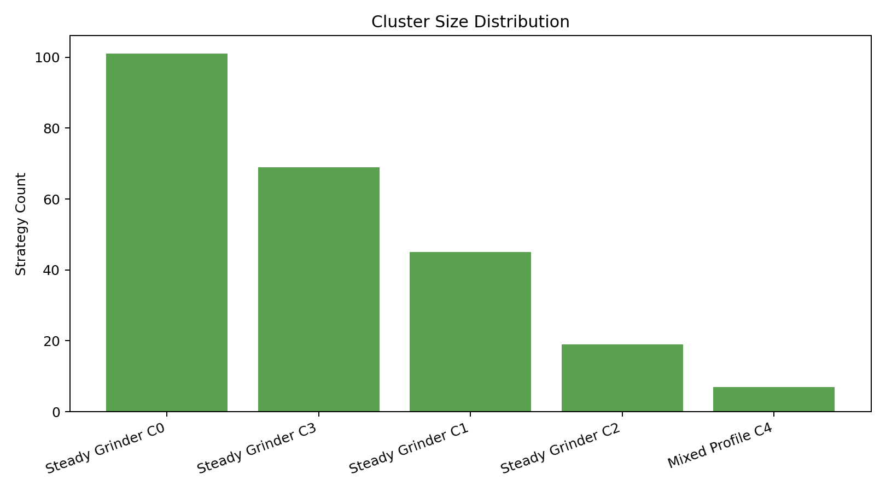
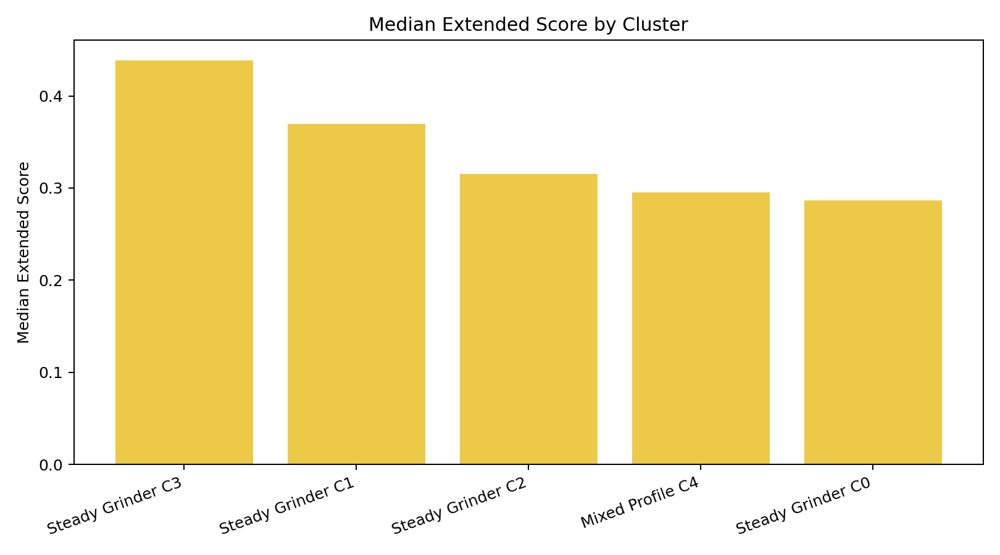
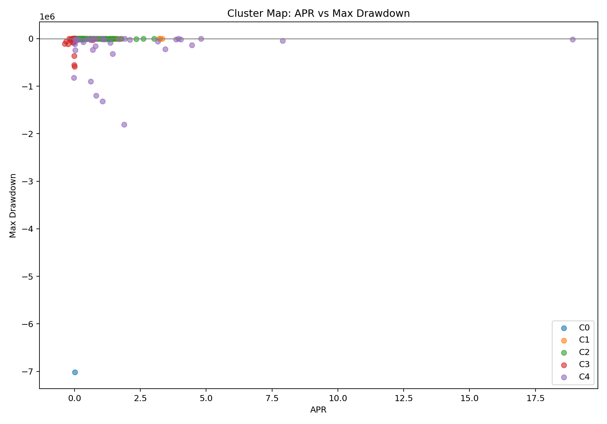
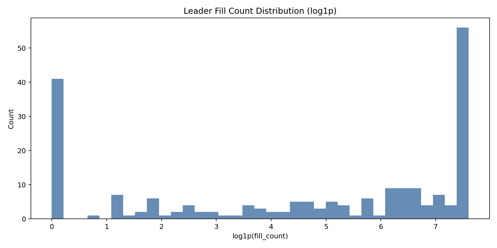
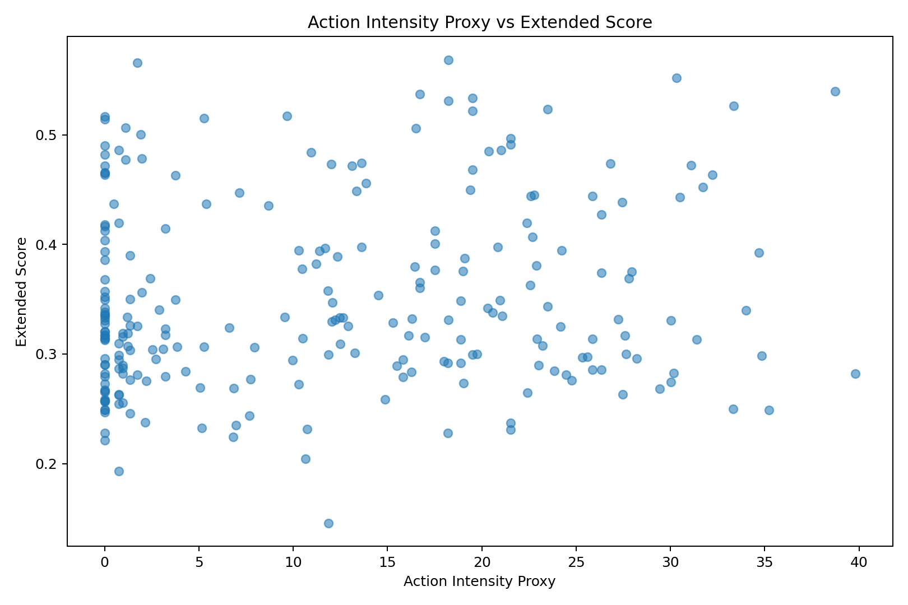
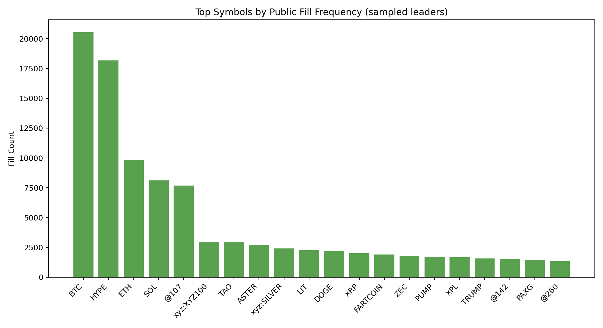

# StratDistill

Hyperliquid 公开策略 / Vault 跟踪、评分、分群与可视化项目（public-data first）。

> **当前状态：已暂停自动更新（manual-only）**  
> 仓库保留现有数据、分析结果与可视化；后续如需继续跟踪，请手动运行刷新命令。

## 1. 项目在做什么

StratDistill 试图用 **完全公开可获取的数据**，对 Hyperliquid 上的公开 vault / strategy 做一个可复用的研究管线：

- 持续发现并跟踪可公开获取信息的策略 / vault
- 生成原始快照、结构化表、扩展评分、分群结果与图表
- 从 leader public fills 提取 **action / position proxy**，补充对执行风格的侧写
- 输出一个可本地浏览的静态前端，查看收益时序与 action proxy 点位

**不使用私有接口，不假设不可公开字段。**

## 2. 当前快照（基于仓库内已提交产物）

最新已提交报告时间：`2026-03-08 UTC`

- stats 发现源记录数：`9200`
- 已扩展评分策略数：`243`
- 已完成分群：`5` 个 cluster
- proxy 侧采样 leader：`210`
- 有公开 fills 的 leader：`169`
- sampled fills 总量：`151,730`

### 当前 extended rank Top 5

1. `+convexity` — score `0.5684`，TVL `494,966`，最大回撤 `-38,514`
2. `[ Systemic Strategies ] ♾️ HyperGrowth ♾️` — score `0.5656`，TVL `6,831,503`，最大回撤 `-1,317,750`
3. `BTC/ETH CTA | AIM` — score `0.5517`，TVL `96,528`，最大回撤 `-21,288`
4. `Flagship by Fire Labs` — score `0.5397`，TVL `17,831`，最大回撤 `-49,532`
5. `[ Sidelined ] Market Neutral 1` — score `0.5372`，TVL `36,061`，最大回撤 `-2,023`

## 3. 数据源

### 官方公开接口
- `POST https://api.hyperliquid.xyz/info`
  - `type=vaultSummaries`：当前观察中基本返回空数组
  - `type=vaultDetails`：可返回单 vault 的详细字段（portfolio、commission、withdrawable 等）

### 公开 stats 端点
- `GET https://stats-data.hyperliquid.xyz/Mainnet/vaults`
  - 当前 discovery 主来源，可获取 summary / apr / pnls

## 4. 方法框架

### 4.1 基础评分（composite_score）
综合以下维度进行多因子排序：

- APR
- TVL
- followers
- all-time PnL
- 最大回撤
- 稳定性
- 数据质量

当部分字段缺失时，权重会在可用字段上动态重归一化；closed vault 会收到固定惩罚。

### 4.2 扩展评分（extended_score）
在 composite_score 基础上继续加入：

- commission 友好度（低更好）
- withdrawable ratio（高更好）
- 账户价值历史深度（all-time account value 点数）

### 4.3 分群（KMeans）
使用标准化后的特征做 cohort 分析：

- APR
- TVL
- PnL
- 回撤
- 稳定性
- extended_score
- 历史深度
- commission

### 4.4 Action / Position Proxy
基于 leader 的公开 fills 构造 proxy 特征：

- `action_intensity = log1p(fill_count) * log1p(symbol_count)`
- `position_turnover_proxy = log1p(avg_abs_fill_size) * log1p(fill_count)`
- `execution_consistency_proxy = active_day_count / active_span_days`

> 这部分是 **公开成交行为代理变量**，不是完整私有持仓账本。

## 5. 可视化总览

### 5.1 排名与风险收益画像

**Top 20 Extended Score**



简要观察：
- 排名不是简单按 APR 排；当前高分策略更多是 **多指标平衡结果**。
- 一些 APR 并不突出的策略，仍可能因回撤、稳定性、可提取性、数据完整性而排到前列。

**APR vs Drawdown vs TVL**



简要观察：
- 高 TVL 不等于高分，高体量策略往往同时伴随更高 drawdown 暴露。
- 小体量策略中存在一批风险控制更稳、得分更均衡的候选。

**TVL Distribution (log10)**



简要观察：
- TVL 呈现明显长尾分布，少数超大 vault 与大量中小 vault 并存。
- 因此简单用 TVL 做排序会有很强偏置，多因子评分是必要的。

### 5.2 数据覆盖与稳健性

**Feature Missingness Ratio**



简要观察：
- 公共数据字段覆盖并不均匀，因此该项目在评分时显式处理缺失值问题。
- 这也是 README 中一直强调“public-data first，而不是 pretending to know private fields”的原因。

### 5.3 分群结果

**Cluster Size Distribution**



**Cluster Median Score**



**Cluster APR / Drawdown Profile**



简要观察：
- 当前 243 个策略被分为 5 个 cluster，其中大多数落在 **Steady Grinder** 系列群组。
- 一个很小的 `Mixed Profile` cluster 聚集了超大 TVL / 异常轮廓策略，是需要单独看待的 outlier bucket。
- 这更适合做 **cohort 对比**，而不是把 cluster name 误读为“官方策略类别”。

### 5.4 Action Proxy 结果

**Leader Fill Count Distribution**



**Action Intensity Proxy vs Extended Score**



**Top Symbols by Public Fill Frequency**



简要观察：
- 行为活跃度差异很大，leader 的 fill count 分布非常偏态。
- 更高的 action intensity **不自动对应** 更高的 extended score；高频并不天然代表更优。
- proxy 部分更适合用来识别执行风格差异，而不是直接替代绩效评价。

## 6. 一段简短分析

把当前可视化和结构化结果合在一起看，大致有三个结论：

1. **这个数据集里，“强策略”更像是多维平衡，而不是单点极值。**  
   只看 APR 或只看 TVL 都容易被噪声和长尾误导。当前排名更偏向“收益、回撤、稳定性、数据深度、可提取性”的综合均衡。

2. **样本内部存在明显分层。**  
   大部分策略并不是极端高收益型，而是落在若干个相对稳态的 grinder 群组；少数超大 TVL / 异质样本更像 outlier，需要独立分析。

3. **公开 fills 很有价值，但它是风格信息，不是完整真相。**  
   action proxy 能帮助识别 leader 的活跃度、交易覆盖面和可能的换手特征，但无法替代真实私有仓位、未公开风险暴露和完整资金路径。

## 7. 目录结构

- `src/stratdistill/`
  - `client.py`：请求客户端（重试 / 超时）
  - `pipeline.py`：基础刷新与评分
  - `enrich.py`：详情抓取、扩展特征、可视化
  - `clustering.py`：分群分析与群组画像
  - `proxy.py`：公开 fills 的 action / position proxy 分析
- `scripts/refresh.py`：基础刷新
- `scripts/update_all.py`：全链路刷新（推荐）
- `scripts/build_web_data.py`：生成静态前端数据
- `data/raw/`：原始快照
- `data/processed/`：结构化结果
- `reports/`：报告与图表
- `web/`：静态前端页面

## 8. 安装

```bash
python3 -m pip install -r requirements.txt
```

## 9. 运行

### 基础刷新

```bash
cd StratDistill
PYTHONPATH=src python3 scripts/refresh.py --max-vaults 300 --top-n 50
```

### 全量更新（手动）

```bash
cd StratDistill
PYTHONPATH=src python3 scripts/update_all.py --max-vaults 400 --top-n 100 --details-top-k 250 --cluster-k 5 --leader-top-k 200
```

## 10. 前端可视化网站（收益时序 + action proxy）

生成网站数据：

```bash
cd StratDistill
python3 scripts/build_web_data.py --top-n 80 --max-fills-per-strategy 1200
```

本地启动：

```bash
cd StratDistill/web
python3 -m http.server 8080
# 浏览器打开 http://127.0.0.1:8080
```

页面能力：
- 可选策略（Top N）
- 可切换 day / week / month / allTime 收益序列
- 可查看 action proxy 点位（全部 / 开仓类 / 平仓类）

## 11. 主要输出文件

### 原始快照
- `data/raw/vaults_stats_*.json`
- `data/raw/vault_details/details_top*_*.json`
- `data/raw/leader_fills/leader_fills_top*_*.json`

### 结构化结果
- `data/processed/vault_master.csv`
- `data/processed/strategy_registry.csv`
- `data/processed/strategy_ranked_extended.csv`
- `data/processed/strategy_cluster_assignments.csv`
- `data/processed/strategy_cluster_summary.csv`
- `data/processed/leader_fills_summary.csv`
- `data/processed/strategy_action_position_proxy.csv`
- `data/processed/timeseries/*.csv`

### 报告与图表
- `reports/latest_report.md`
- `reports/analysis_extended.md`
- `reports/cluster_report.md`
- `reports/proxy_report.md`
- `reports/figures/*.png`

## 12. 已知限制

- `vaultSummaries` 目前仍基本为空，discovery 依赖公开 stats 端点
- 某些字段覆盖不均（例如 followers）
- public fills 有分页 / 保留深度限制，proxy 分析天然不完整
- cluster 是 cohort analysis，不应被解释成“官方策略 taxonomy”

## 13. 项目状态说明

此前的自动化更新方案已停止使用；当前仓库处于 **暂停自动运行、保留成果、按需手动刷新** 的状态。

如果未来需要恢复：
- 手动运行 `scripts/update_all.py`
- 手动运行 `scripts/build_web_data.py`
- 再决定是否重新配置外部调度

## 14. Git 同步

```bash
git add .
git commit -m "docs: integrate visuals and pause automation"
git push origin master
```
